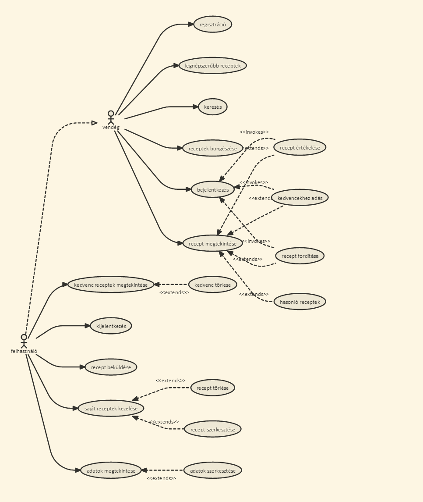

# Receptek és hozzávalók
Alkalmazások fejlesztése 1/3 beadandó

## Funkcionális követelmények
#### Vendég (nem bejelentkezett látogató):
* bejelentkezés
* legnépszerűbb receptek megtekintése
* receptek böngészése
* receptek leirásának, hozzávalóinak, képeinek megtekintése 
* receptek keresése
* honlapra való regisztráció, ami új dolgokkal/funkciókkal látja el a felhasználót
* hasonló receptek megtekintése (hasonló receptek azok, amiknek legalább 5 közös hozzávalójuk van)

#### Bejelentkezett felhasználó:
* kedvenc receptek listájának létrehozása
* különböző receptek értékelése (+1 pont hozzáadódik a recepthez a gomb lenyomásával)
* saját recept beküldése képekkel, hozzávalókkal és leirással
* saját felhasználói adatok szerkesztése
* receptek forditása angolra

## Nem funkcionális követelmények
* biztonság: jelszavak, e-mail cimek tárolása - nem autorizált felhasználó ne férjen hozzá egy felhasználó adataihoz és autorizácóhoz kötött funkciókhoz sem
* egyszerű, érthető, felhasználóbarát felület
* gyors működés

## Szakterületi fogalomjegyzék
* recept:
    * étel elkészitéséhez szükséges hozzávalók leirása
    * étel elkészitésének lépéseit tartalmazó részletes leirása
    * különböző mértékegységek megadása más mértékegységekben, ha a felhasználó úgy dönt le szeretne forditani angolra egy receptet

## Szerepkörök
* vendég: receptek keresését, böngészését, megtekintését végezheti
* felhasználó: receptek keresését, böngészését, megtekintését, saját receptjeinek módositását (új recept, recept törlése, recept képének megváltoztatása), receptek értékelését és más felhasználók által beküldött receptek hozzávalóinak, leirásainak angolra forditását végezheti

## Használati eset diagram (Use Case Diagram)

Link: [http://bit.ly/2dWj9nw](http://bit.ly/2dWj9nw)

## Folyamat diagramok
### Bejelentkezés folyamata

Link: [http://bit.ly/2djnJWt](http://bit.ly/2djnJWt)

### Receptértékelés folyamata

Link: [http://bit.ly/2dTda0d](http://bit.ly/2dTda0d)

### Kedvencekhez adás folyamata

Link: [http://bit.ly/2dWjVki](http://bit.ly/2dWjVki)

### Receptek forditásának folyamata

Link: [http://bit.ly/2ed5Z5u](http://bit.ly/2ed5Z5u)

### Új recept felvételének folyamata

Link: [http://bit.ly/2drKxXo](http://bit.ly/2drKxXo)